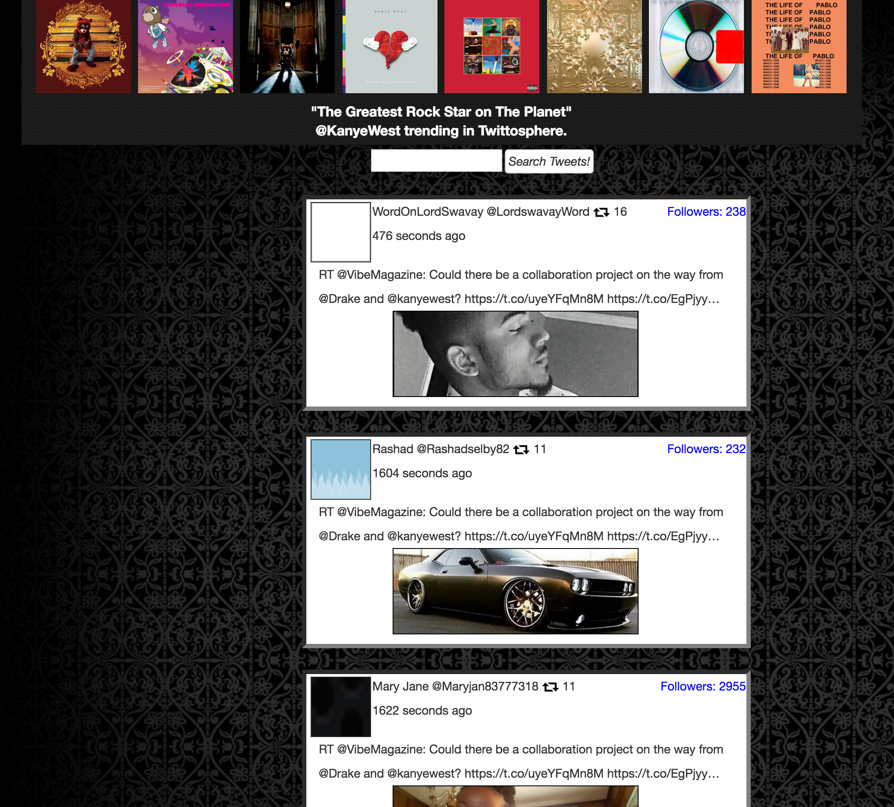

#WebApp created with Angular.js and Twitter's API

###Setup Angular.js to send HTTP get requests to twitter. 
###Requested twitter servers to serve up JSON Object of recent tweets with "@KanyeWest" inside.
###Extracted select values from this JSON Object and inserted into my HTML
###Created text input field to search, on submit, whatever user searches trending in the twitosphere.
